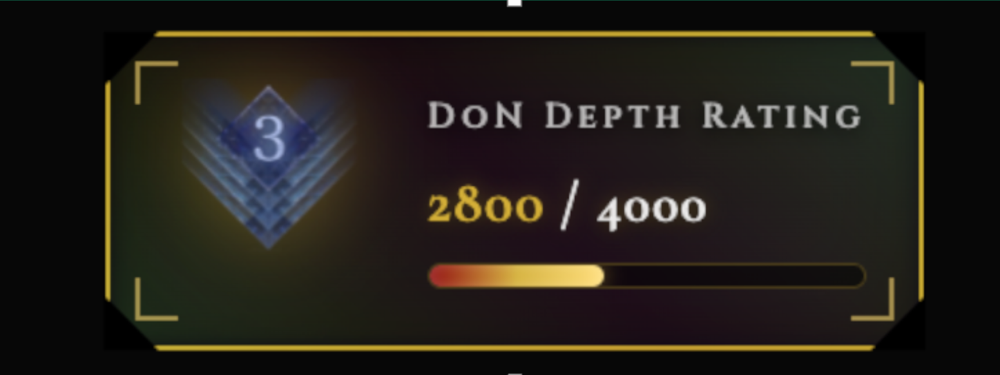
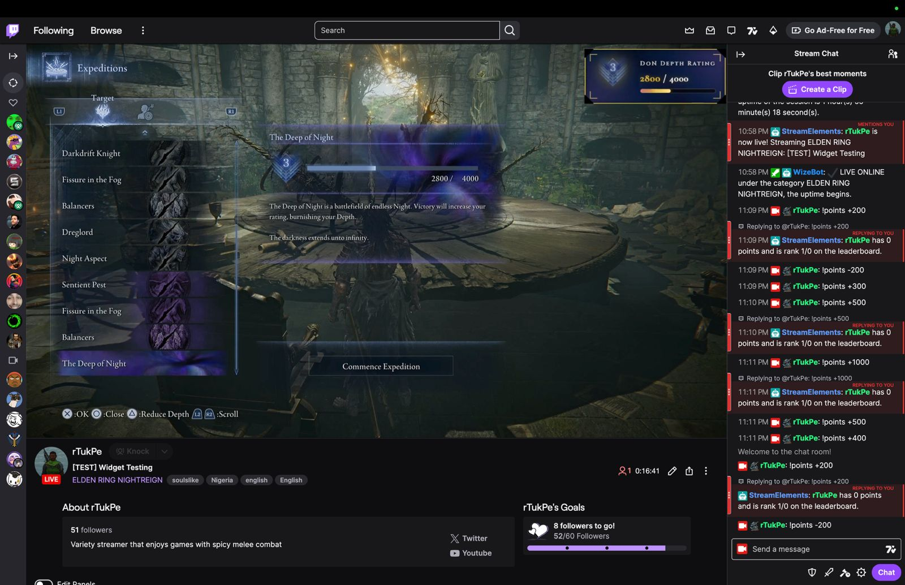

# Deep of Night Depth Widget - Usage Instructions


## Setup in Streamlabs OBS

1. **Add Browser Source:**
   - Click + in Sources
   - Select "Browser Source"
   - Set Width: **500**
   - Set Height: **180**
   - Browse to `deep-of-night-depth-widget.html`
   - Check "Shutdown source when not visible" (optional)
   - Click "Done"

2. **Position the widget** on your stream layout

## Updating Your Points

### Method 1: Twitch Chat Commands (Recommended!)
This is the easiest way for you and your mods to update points during stream.

**Setup (One-time):**
1. Right-click the browser source in Streamlabs OBS → "Interact"
2. Hover over the widget to reveal the full-screen controls
3. In the "TWITCH INTEGRATION" section (left side):
   - Enter your Twitch channel name (e.g., "your_username")
   - Click "Connect"
   - Wait for status to show "Connected"
4. Close the interact window

**Note:** Your channel name is saved automatically and the widget will auto-connect on next page load!

**Usage in Twitch Chat:**
- `!don +200` - Add 200 points (after a win)
- `!don -400` - Subtract 400 points (after a loss)
- `!don +150` - Add any amount
- `!don -600` - Subtract any amount

**Permissions:**
- Only **you** (the broadcaster) and **mods** can use this command
- Regular viewers cannot change the points

### Method 2: Interactive Controls
1. Right-click the browser source in Streamlabs OBS
2. Select "Interact"
3. Hover over the widget to reveal the full-screen control panel
4. Use the "MANUAL CONTROLS" section (right side):
   - **+100** / **+200** - Add points (after wins)
   - **-100** / **-200** - Subtract points (after losses)
   - Or type exact points in the input field and click "Set Points"
5. Close the interact window

## Features

- **Auto-calculates Depth** based on your points (1-5)
- **Official depth icons** from the Elden Ring Nightreign wiki
- **Progress bar** shows how close you are to ranking up
- **Persistent storage** - your points save between OBS sessions
- **Twitch chat integration** - you and mods can update via `!don` command
- **Auto-connect** - saves your Twitch channel and reconnects automatically on page load
- **Full-screen controls** - hover to reveal controls that take up the entire view with side-by-side layout
- **Depth thresholds:**
  - Depth 1: 0 → 1,000 points
  - Depth 2: 1,000 → 2,000 points
  - Depth 3: 2,000 → 4,000 points
  - Depth 4: 4,000 → 6,000 points
  - Depth 5: 6,000+ points (endless)

## Common Point Changes

Based on the game:
- **Win at Depth 2:** +200 to +300 points
- **Win at Depth 3:** +200 to +300 points
- **Loss at Depth 3:** -200 points
- **Loss at Depth 4:** -400 points
- **Loss at Depth 5:** -600 points
- **Early loss (Day 1):** Additional -200 penalty
- **Early loss (Day 2):** Additional -100 penalty

## Twitch Command Examples

After a win:
```
You: !don +250
```

After a loss on Depth 5:
```
Mod: !don -600
```

After an early Day 1 loss:
```
You: !don -400
```

## Troubleshooting

**Twitch not connecting?**
- Make sure your channel name is correct (lowercase, no spaces)
- Check that you have internet access
- Try disconnecting and reconnecting
- Widget auto-connects on page load if you've connected before

**Commands not working?**
- Verify you're connected (status shows "Connected")
- Make sure the command format is correct: `!don +200` or `!don -200`
- Only broadcaster and mods can use the command

**Points not saving?**
- Points are saved in browser localStorage
- Don't clear browser cache in OBS settings
- If you delete the browser source, points will reset

## Additional Stuff


